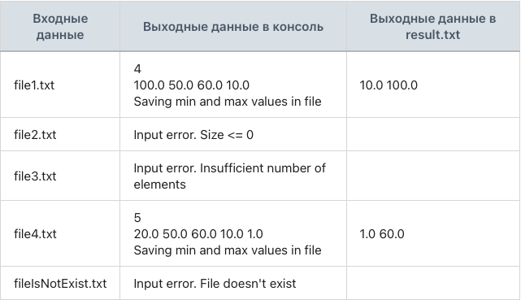

## Задание 7. Поиск максимального и минимального значений

### Разработай математический модуль, который производит поиск максимального и минимального значений в массиве.

Программа считывает путь до файла.
Программа считывает из файла количество чисел.
Программа считывает каждое новое число из файла в массив, пока не превысит количество чисел либо не достигнет конца файла.
Программа работает с вещественными числами.
Программа выводит считанное количество чисел и сами числа.
Программа сохраняет в файл result.txt найденные минимум и максимум и выводит в консоль сообщение: «Saving min and max values in file».
Если считалось чисел меньше, чем указано в количестве, должно выводиться: «Input error. Insufficient number of elements».
Если файла не существует, то должно выводиться: «Input error. File doesn't exist».
Если отрицательное количество чисел или ноль, то должно выводиться: «Input error. Size <= 0».
Программа не завершается с ошибкой при некорректных входных данных. Она пропускает ошибочный ввод и переходит к следующему считыванию значения.

- file1.txt
- 4
- 100.0 50.0 60.0 10.0

- file2.txt
- 0
- 100.0 50.0 60.0 10.0

- file3.txt
- 10
- 100.0 50.0 60.0 10.0

- file4.txt
- 5
- 20.0 50.0 f 60.0 g 10.0 1.0

