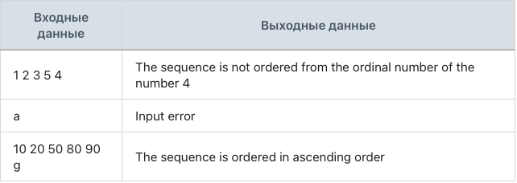

## Задание 8. Упорядоченная последовательность по возрастанию

### Разработай математический модуль, который определяет, является ли последовательность упорядоченной по возрастанию.

Программа считывает каждое новое число.
Программа работает с целыми числами.
Нельзя использовать массивы.
Программа должна определить, является ли последовательность упорядоченной по возрастанию. В случае отрицательного ответа программа должна определить порядковый номер первого числа, нарушающего такую упорядоченность, и вывести: «The sequence is not ordered from the ordinal number of the number (порядковый номер)».
Программа завершает проверку введенной последовательности при некорректном вводе и выводит: «The sequence is ordered in ascending order», если было введено хотя бы одно число.
Если не ввели ни одного числа, то должно выводиться: «Input error».
Используй только простые типы.

