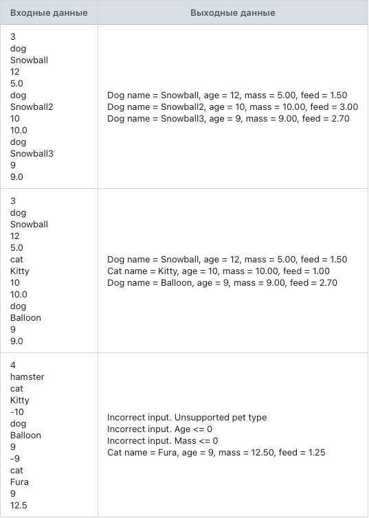

## Задание 2. Определение количества корма питомцу

### Разработай модуль, который по типу питомца определяет, сколько граммов корма ему необходимо на 1 порцию.

Создай абстрактный класс Animal с тремя private-полями: строка имени питомца, целочисленный возраст, вещественный вес питомца.
Реализуй конструктор для абстрактного класса Animal, который принимает три параметра: строка имени питомца, целочисленный возраст, вещественный вес питомца и присваивает соответствующим полям передаваемые значения.
Реализуй геттеры для private-полей: строка имени питомца, целочисленный возраст, вещественный вес питомца.
Объяви в абстрактном классе Animal метод getFeedInfoKg(), который возвращает вещественное количество корма.
Создай класс Dog, который наследуется от абстрактного класса Animal.
Реализуй конструктор для класса Dog, который принимает три параметра: строка имени питомца, целочисленный возраст, вещественный вес питомца и передает их в конструктор базового класса.
Реализуй метод getFeedInfoKg() в классе Dog, который вычисляет количество необходимого корма по следующей формуле: количество корма = масса питомца * 0.3.
Переопредели метод toString() в классе Dog, чтобы формировалась следующая строка: «Dog name = [имя_питомца], age = [возраст_питомца], mass = [масса_питомца], feed = [порция_питомца]».
Создай класс Cat, который наследуется от абстрактного класса Animal.
Реализуй конструктор для класса Cat, который принимает три параметра: строка имени питомца, целочисленный возраст, вещественный вес питомца и передает их в конструктор базового класса.
Реализуй метод getFeedInfoKg() в классе Cat, который вычисляет количество необходимого корма по следующей формуле: количество корма = масса питомца * 0.1.
Переопредели метод toString() в классе Cat, чтобы формировалась следующая строка: «Cat name = [имя_питомца], age = [возраст_питомца], mass = [масса_питомца], feed = [порция_питомца]».
Программа считывает количество питомцев.
Программа считывает тип вводимого питомца: dog/cat.
Каждый питомец добавляется в общий список pets.
Если ввели неправильный тип питомца, то программа выводит: «Incorrect input. Unsupported pet type» и переходит к следующему вводу.
Если ввели отрицательный или нулевой возраст, то программа выводит: «Incorrect input. Age <= 0» и переходит к следующему вводу.
Если ввели отрицательную или нулевую массу, то программа выводит: «Incorrect input. Mass <= 0» и переходит к следующему вводу.
Программа не завершается с ошибкой при некорректных входных данных. Она выводит: «Could not parse a number. Please, try again» и повторяет попытку ввода.
Программа должна вывести информацию о каждом питомце и количество корма, которое ему необходимо.
Программа работает со ссылочными типами данных.

