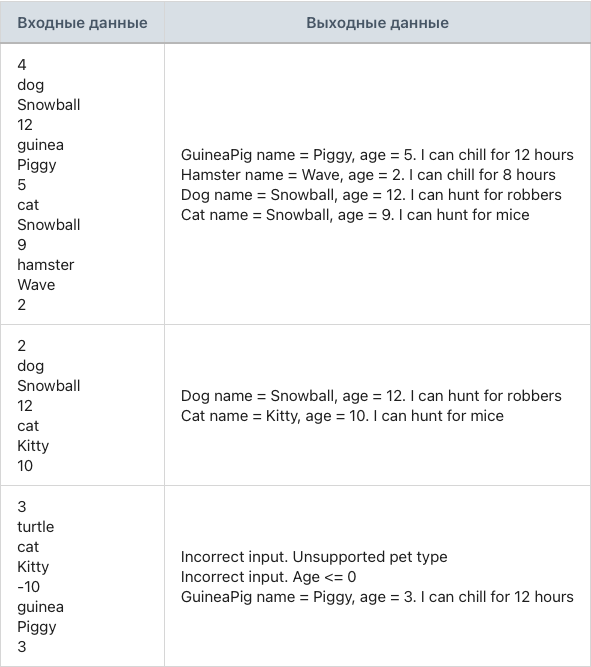

## Задание 3. Списки травоядных и всеядных питомцев

### Разработай модуль, который сначала выводит только травоядных животных, а затем только всеядных животных.

Создай абстрактный класс Animal с двумя private-полями: строка имени питомца, целочисленный возраст.
Реализуй конструктор для абстрактного класса Animal, который принимает два параметра: строка имени питомца, целочисленный возраст и присваивает соответствующим полям передаваемые значения.
Реализуй геттеры для private-полей: строка имени питомца, целочисленный возраст.
Создай интерфейс Herbivore.
Объяви в интерфейсе Herbivore метод chill(), который возвращает строку.
Создай интерфейс Omnivore.
Объяви в интерфейсе Omnivore метод hunt(), который возвращает строку.
Создай класс Dog, который наследуется от абстрактного класса Animal и реализует интерфейс Omnivore.
Реализуй конструктор для класса Dog, который принимает два параметра: строка имени питомца, целочисленный возраст.
Конструктор класса Dog передает строку имени питомца и целочисленный возраст в конструктор базового класса.
В классе Dog реализуй метод hunt() таким образом, чтобы формировалась следующая строка: «I can hunt for robbers».
В классе Dog переопредели метод toString() таким образом, чтобы формировалась следующая строка: «Dog name = [имя_питомца], age = [возраст_питомца]. » + hunt().
Создай класс Cat, который наследуется от абстрактного класса Animal и реализует интерфейс Omnivore.
Реализуй конструктор для класса Cat, который принимает два параметра: строка имени питомца, целочисленный возраст.
Конструктор класса Cat передает строку имени питомца и целочисленный возраст в конструктор базового класса.
В классе Cat реализуй метод hunt() таким образом, чтобы формировалась следующая строка: «I can hunt for mice».
В классе Cat переопредели метод toString() таким образом, чтобы формировалась следующая строка: «Cat name = [имя_питомца], age = [возраст_питомца]. » + hunt().
Создай класс Hamster, который наследуется от абстрактного класса Animal и реализует интерфейс Herbivore.
Реализуй конструктор для класса Hamster, который принимает два параметра: строка имени питомца, целочисленный возраст.
Конструктор класса Hamster передает строку имени питомца и целочисленный возраст в конструктор базового класса.
В классе Hamster реализуй метод chill() таким образом, чтобы формировалась следующая строка: «I can chill for 8 hours».
В классе Hamster переопредели метод toString() таким образом, чтобы формировалась следующая строка: «Hamster name = [имя_питомца], age = [возраст_питомца]. » + chill().
Создай класс GuineaPig, который наследуется от абстрактного класса Animal и реализует интерфейс Herbivore.
Реализуй конструктор для класса GuineaPig, который принимает два параметра: строка имени питомца, целочисленный возраст.
Конструктор класса GuineaPig передает строку имени питомца и целочисленный возраст в конструктор базового класса.
В классе GuineaPig реализуй метод chill() таким образом, чтобы формировалась следующая строка: «I can chill for 12 hours».
В классе GuineaPig переопредели метод toString() таким образом, чтобы формировалась следующая строка: «GuineaPig name = [имя_питомца], age = [возраст_питомца]. » + chill().
Программа считывает количество питомцев.
Программа считывает тип вводимого питомца: dog/cat/hamster/guinea.
Каждый питомец добавляется в общий список pets.
Если ввели неправильный тип питомца, то программа выводит: «Incorrect input. Unsupported pet type» и переходит к следующему вводу.
Если ввели отрицательный или нулевой возраст, то программа выводит: «Incorrect input. Age <= 0» и переходит к следующему вводу.
Программа не завершается с ошибкой при некорректных входных данных. Она выводит: «Could not parse a number. Please, try again» и повторяет попытку ввода.
Программа сначала должна вывести информацию обо всех травоядных питомцах, а потом обо всех всеядных питомцах.
Программа работает со ссылочными типами данных.

