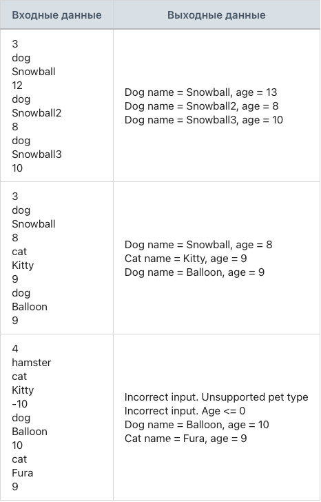

## Задание 4. Увеличение возраста конкретных питомцев в функциональной парадигме

### Разработай модуль, который увеличивает возраст питомцев старше 10 лет, придерживаясь функциональной парадигмы.

Создай абстрактный класс Animal с двумя private-полями: строка имени питомца, целочисленный возраст.
Реализуй конструктор для абстрактного класса Animal, который принимает два параметра: строка имени питомца, целочисленный возраст и присваивает соответствующим полям передаваемые значения.
Реализуй геттеры для private-полей: строка имени питомца, целочисленный возраст.
Создай класс Dog, который наследуется от абстрактного класса Animal.
Реализуй конструктор для класса Dog, который принимает два параметра: строка имени питомца, целочисленный возраст и передает их в конструктор базового класса.
Переопредели метод toString() в классе Dog, чтобы формировалась следующая строка: «Dog name = [имя_питомца], age = [возраст_питомца]».
Создай класс Cat, который наследуется от абстрактного класса Animal.
Реализуй конструктор для класса Cat, который принимает два параметра: строка имени питомца, целочисленный возраст и передает их в конструктор базового класса.
Переопредели метод toString() в классе Cat, чтобы формировалась следующая строка: «Cat name = [имя_питомца], age = [возраст_питомца]».
Программа считывает количество питомцев.
Программа считывает тип вводимого питомца: dog/cat.
Каждый питомец добавляется в общий список pets.
Если ввели неправильный тип питомца, то программа выводит: «Incorrect input. Unsupported pet type» и переходит к следующему вводу.
Если ввели отрицательный или нулевой возраст, то программа выводит: «Incorrect input. Age <= 0» и переходит к следующему вводу.
Программа не завершается с ошибкой при некорректных входных данных. Она выводит: «Could not parse a number. Please, try again» и повторяет попытку ввода.
Программа должна увеличить возраст всех питомцев старше 10 лет на 1 год.
Программа должна вывести информацию о каждом питомце.
Программа работает со ссылочными типами данных.
Программа должна придерживаться функциональной парадигмы.
Программа должна использовать Stream API.
Запрещается использовать любые операторы повторения.

