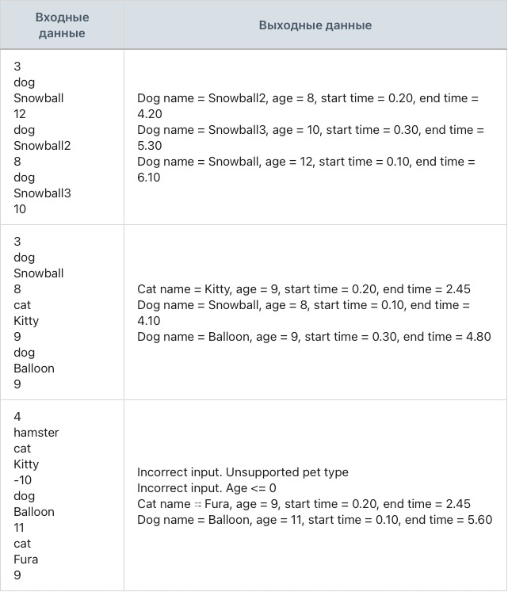

## Задание 5. Отслеживание прогулок питомцев

### Разработай модуль, который отслеживает время начала и завершения прогулки питомца.

Создай абстрактный класс Animal с двумя private-полями: строка имени питомца, целочисленный возраст.
Реализуй конструктор для абстрактного класса Animal, который принимает два параметра: строка имени питомца, целочисленный возраст и присваивает соответствующим полям передаваемые значения.
Реализуй геттеры для private-полей: строка имени питомца, целочисленный возраст.
Объяви в абстрактном классе Animal метод goToWalk() метод goToWalk(), который возвращает вещественное время.
Создай класс Dog, который наследуется от абстрактного класса Animal.
Реализуй конструктор для класса Dog, который принимает два параметра: строка имени питомца, целочисленный возраст и передает их в конструктор базового класса.
Переопредели метод toString() в классе Dog, чтобы формировалась следующая строка: «Dog name = [имя_питомца], age = [возраст_питомца]».
Переопредели метод goToWalk() в классе Dog следующим образом: метод вычисляет время прогулки в секундах, вызывает TimeUnit.SECONDS.sleep() для вычисленного времени, возвращает вычисленное время.
Создай класс Cat, который наследуется от абстрактного класса Animal.
Реализуй конструктор для класса Cat, который принимает два параметра: строка имени питомца, целочисленный возраст и передает их в конструктор базового класса.
Переопредели метод toString() в классе Cat, чтобы формировалась следующая строка: «Cat name = [имя_питомца], age = [возраст_питомца]».
Переопредели метод goToWalk() в классе Cat следующим образом: метод вычисляет время прогулки в секундах, вызывает TimeUnit.SECONDS.sleep() для вычисленного времени, возвращает вычисленное время.
Вычисление времени прогулки для класса Dog выполняется по следующей формуле: [время_прогулки] = [возраст_питомца] * 0,5.
Вычисление времени прогулки для класса Cat выполняется по следующей формуле: [время_прогулки] = [возраст_питомца] * 0,25.
Программа считывает количество питомцев.
Программа считывает тип вводимого питомца: dog/cat.
Каждый питомец добавляется в общий список pets.
Если ввели неправильный тип питомца, то программа выводит: «Incorrect input. Unsupported pet type» и переходит к следующему вводу.
Если ввели отрицательный или нулевой возраст, то программа выводит: «Incorrect input. Age <= 0» и переходит к следующему вводу.
Программа не завершается с ошибкой при некорректных входных данных. Она выводит: «Could not parse a number. Please, try again» и повторяет попытку ввода.
Программа должна вызвать метод goToWalk() у каждого питомца.
Каждый вызов метода goToWalk() должен выполняться асинхронно в отдельном потоке.
Программа должна дождаться выполнения всех вызовов метода goToWalk(), перед тем как завершиться.
При завершении прогулки программа должна выводить на одной строке в консоль следующую информацию: информация о питомце, время старта прогулки, время конца прогулки.
Время старта прогулки и время конца прогулки должны вычисляться относительно времени старта программы.
Программа работает со ссылочными типами данных.
Разница времени старта прогулки у питомцев относительно друг друга не должна быть больше 1 секунды.

