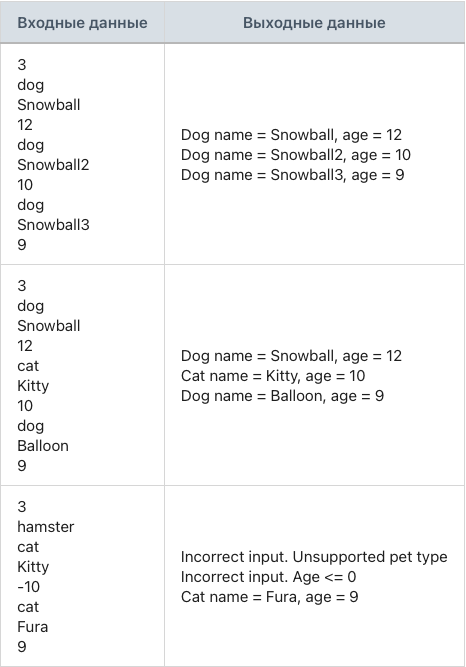

## Задание 6. Итератор питомцев

### Разработай модуль, который реализует итератор питомцев.

Создай абстрактный класс Animal с двумя private-полями: строка имени питомца, целочисленный возраст.
Реализуй конструктор для абстрактного класса Animal, который принимает два параметра: строка имени питомца, целочисленный возраст и присваивает соответствующим полям передаваемые значения.
Реализуй геттеры для private полей: строка имени питомца, целочисленный возраст.
Создай класс Dog, который наследуется от абстрактного класса Animal.
Реализуй конструктор для класса Dog, который принимает два параметра: строка имени питомца, целочисленный возраст и передает их в конструктор базового класса.
Переопредели метод toString() в классе Dog, чтобы формировалась следующая строка: «Dog name = [имя_питомца], age = [возраст_питомца]».
Создай класс Cat, который наследуется от абстрактного класса Animal.
Реализуй конструктор для класса Cat, который принимает два параметра: строка имени питомца, целочисленный возраст и передает их в конструктор базового класса.
Переопредели метод toString() в классе Cat, чтобы формировалась следующая строка: «Cat name = [имя_питомца], age = [возраст_питомца]».
Создай интерфейс BaseIterator.
Объяви в интерфейсе BaseIterator метод next(), который возвращает элемент типа T.
Объяви в интерфейсе BaseIterator метод hasNext(), который возвращает boolean.
Объяви в интерфейсе BaseIterator метод reset(), который ничего не возвращает.
Создай класс AnimalIterator, который реализует интерфейс BaseIterator.
В классе AnimalIterator объяви 2 private-поля: список животных, целочисленный индекс текущего элемента списка.
Реализуй конструктор для класса AnimalIterator, который принимает список животных и присваивает его соответствующему полю.
В классе AnimalIterator реализуй метод next() следующим образом: метод возвращает текущий элемент списка животных, а затем увеличивает индекс текущего элемента списка на единичку.
В классе AnimalIterator реализуй метод hasNext() следующим образом: метод возвращает true, если индекс текущего элемента списка меньше количества элементов списка животных, иначе false.
В классе AnimalIterator реализуй метод reset() следующим образом: метод сбрасывает значение индекса текущего элемента списка.
Программа считывает количество питомцев.
Программа считывает тип вводимого питомца: dog/cat.
Каждый питомец добавляется в общий список pets.
Если ввели неправильный тип питомца, то программа выводит: «Incorrect input. Unsupported pet type» и переходит к следующему вводу.
Если ввели отрицательный или нулевой возраст, то программа выводит: «Incorrect input. Age <= 0» и переходит к следующему вводу.
Программа не завершается с ошибкой при некорректных входных данных. Она выводит: «Could not parse a number. Please, try again» и повторяет попытку ввода.
Программа должна вывести информацию о каждом питомце.
Программа должна пройтись по списку питомцев pets с помощью итератора AnimalIterator.
Программа работает со ссылочными типами данных.

